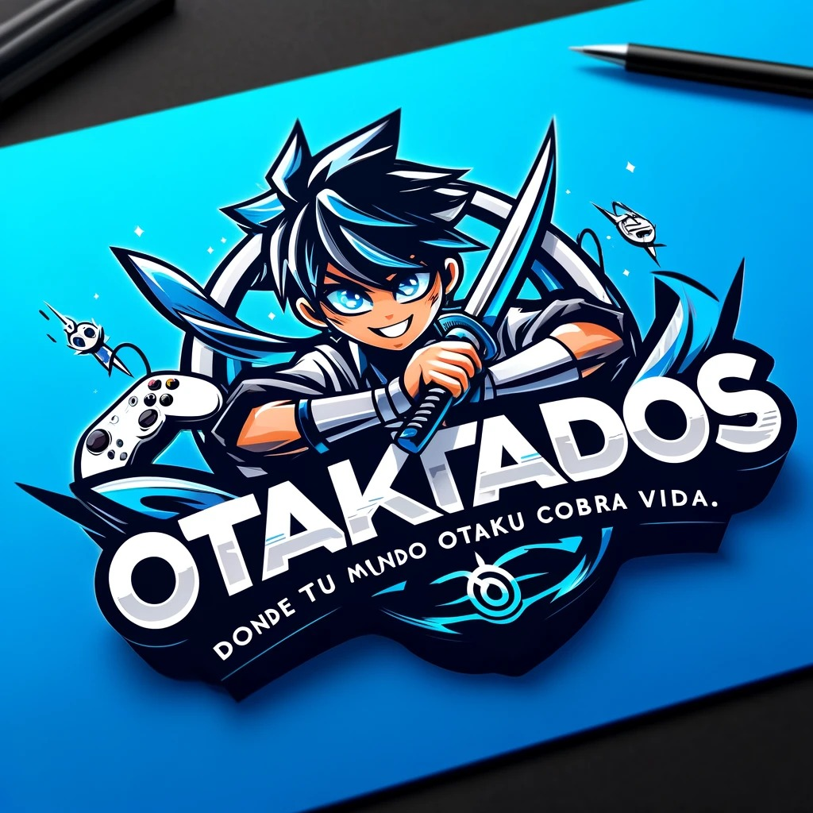

# Otakunizados



**Otakunizados** es una aplicación móvil desarrollada en Flutter, pensada para la comunidad otaku. Centraliza noticias, eventos, anime, foros y mucho más en una única plataforma personalizable y escalable.

---

## ✨ Descripción

Otakunizados busca ser el punto de encuentro digital para fans del anime, manga y la cultura japonesa. A través de una interfaz moderna y fluida, la app ofrece contenido personalizado, foros, noticias, eventos y un calendario otaku.

---

## 🚀 Características principales

- 📰 Noticias actualizadas del mundo otaku  
- 📅 Calendario de estrenos de anime y eventos frikis  
- 🧑‍🤝‍🧑 Foros y comunidad  
- 🔔 Notificaciones personalizadas  
- 🌍 Geolocalización para eventos cercanos  
- 📱 Multiplataforma (Android, iOS) con Flutter  

---

## 🛠️ Tecnologías usadas

- [Flutter](https://flutter.dev/) para desarrollo multiplataforma  
- [Firebase](https://firebase.google.com/) para autenticación y base de datos  
- [Anilist API](https://anilist.gitbook.io) para datos de anime  
- Visual Studio Code como IDE principal  

---

## 📁 Estructura del proyecto
```plaintext
lib/
├── main.dart                     # Punto de entrada de la app
├── models/                      # Modelos de datos
│   ├── anime_model.dart              # Modelo para información de anime
│   ├── anime_schedule_model.dart    # Modelo para calendario de emisión
│   ├── event_model.dart              # Modelo para eventos frikis
│   └── news_model.dart               # Modelo para noticias otaku
│
├── provider/                   # Gestión de estado y lógica de autenticación
│   └── login_provider.dart         # Proveedor para login y autenticación
│
├── screens/                    # Pantallas agrupadas por funcionalidades
│   ├── auth/                       # Autenticación
│   │   ├── login_screen.dart
│   │   ├── register_screen.dart
│   │   └── forgot_password_screen.dart
│   ├── calendar/
│   │   └── calendar_screen.dart     # Calendario de anime y eventos
│   ├── events/
│   │   └── events_screen.dart       # Listado de eventos frikis
│   ├── news/
│   │   ├── news_list_screen.dart
│   │   └── news_screen.dart         # Detalle de una noticia
│   └── home/
│       └── home_screen.dart         # Pantalla principal
│
├── services/                  # Lógica de negocio, APIs y base de datos
│   ├── anilist_service.dart              # Llamadas a la API de Anilist
│   ├── anime_firestore_service.dart      # Guardado de anime en Firestore
│   ├── anime_schedule_service.dart       # Lógica para el calendario
│   ├── anime_schedule_firestore_service.dart
│   └── login_services.dart              # Autenticación con Firebase
│
├── widgets/                   # Componentes reutilizables de UI
│   ├── app_scaffold.dart             # Scaffold común con navegación
│   ├── bottom_nav_bar.dart           # Barra de navegación inferior
│   ├── news_card.dart                # Tarjeta para noticias
│   └── auth_background.dart          # Fondo decorativo para pantallas de auth

````
---

## Estado del proyecto

Actualmente en desarrollo activo. Se agradecen colaboraciones y feedback para mejorar la plataforma.

---

## Cómo contribuir

Si quieres contribuir, por favor sigue estos pasos:

1. Haz un fork del repositorio  
2. Crea una rama con tu feature: `git checkout -b feature/nombre-feature`  
3. Haz commit de tus cambios: `git commit -m 'Añade nueva funcionalidad'`  
4. Haz push a tu rama: `git push origin feature/nombre-feature`  
5. Abre un Pull Request para revisión  

---

## Contacto

Para más información o preguntas, puedes contactarme en:

- [GitHub](https://github.com/ConchiDP)  
- [LinkedIn](https://www.linkedin.com/in/conchidiaz/)
- Email: conchidiazprogramacion@gmail.com

---

¡Gracias por visitar Otakunizados!  
---

*Este proyecto está en constante evolución, sigue atento a nuevas actualizaciones.*  
